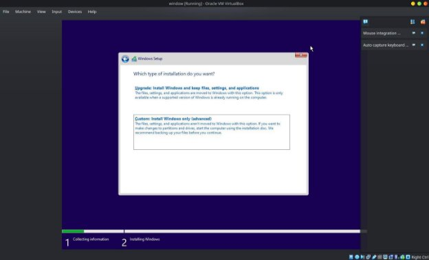

Course : Operating System Assignment : Lab-1.

Group Members : Arham Imran (2022-CS-209), Abdullah Azher Chaudhary (2022-CS-204).

Windows Installation Lab Manual

Step - 1 : Creating a Bootable USB or Using a Windows DVD or CD.

If you want to use USB Flash drive to install Windows you can create a bootable USB by downloading Windows iso file and using a software that creates a bootable USB like Rufus. And you can use the following steps.

- Download The Rufus.exe from the following link[ https://rufus.ie/en/ ](https://rufus.ie/en/)

  

- After downloading the rufus exe file you need to have your existing iso file and a USB drive of at least 8GB of size.
- Then follow the following steps
- Double click the **Rufux.exe** to launch the tool.
- Under “**Device**” Section, select the USB flash drive.
- Under the “**Book selection**”, click the **select** button on the right.
- Selection the Windows **iso** file.
- Click the **Open** button.
- Use the “Image option” drop down menu and select “**Standard Windows installation**” option.
- Use the “Partition Scheme” drop-down menu and select **GPT** or **MBR** according to your hardware. To check your partition type visit [https://www.howtogeek.com/245610/how-to-check-if-a-disk-uses-gpt-or-mbr-and-how- to-convert-between-the-two/.](https://www.howtogeek.com/245610/how-to-check-if-a-disk-uses-gpt-or-mbr-and-how-to-convert-between-the-two/)
- Under the volume label field confirm the name of the bootable USB like “Windows USB”.
- Do not change any other things unless you know what you’re doing.
- Do not check any customization installation settings.

  

- Click OK to confirm.

  

- Click Start and wait until it completes.
- After it completes you have successfully created a bootable USB drive.

Step – 2 : Booting up using Windows Installation Media

In this step you to boot the USB or Drive in which you’re using to install windows using boot menu. Different computers\laptops have different keys. Check your devices boot menu key on it’s manual. On the boot menu select USB\DVD which you’re using to install windows.

In the following picture, A USB is used to install windows.

Step – 3 : Backup data and Windows system requirements.

Make sure to check your respective Windows System Requirements before installing it and also to back up your data on external storage space. Following System Configuration is used in our system

Step – 4 : Booting from DVD\USB:

The following option will show up if you have selected your windows bootable drive in Boot Menu, Press any key to continue.

Step – 5 : Language, Time & Currency format and Keyboard layout:

Select your Language, Time and Currency format and Keyboard layout from the drop-down menu given for each option.

Step – 6 : Click on Install:

After step following menu will appear, Click on Install now option:

Step – 7 : Select edition:

Select Windows edition you want to install from the following menu that will appear after step 6.

Step - 8 : Accept the license terms.

Accept the license term of windows.

Step – 9 : Select type of installation.

Select “Custom: Install Windows only (advance)” to install new Windows.

Step – 10 : Select storage where to install windows:

Select the storage drive where you want to install windows. If you already have partitions you can delete them(Remember to back up your data because doing this will wipe out all of your data stored in the device). Select any partition that satisfies the requirement or delete a new one by clicking on “New” option.

Step – 11 : Setting size of the partition.

If you have selected “new” then set the appropriate size of the partition where you want to install Windows. Click on apply a new partition will be created.

Step – 12 : Select the partition where to install Windows.

Select the appropriate partition where you want to install Windows and then click ‘next’.

Step – 13 : Installing Windows.

Now wait for the installation to complete. The following window will appear during installation.

Step – 14 : System Reload:

After installation of windows. System will reload and Windows will start service. It’ll take one to two minutes.

Step – 15 : Setup User Configuration.

Setup your user configuration.

STEP – 16 : Final Step

Your windows is finally installed, Connect to internet if you haven’t already. Windows will automatically install drivers related to your hardware devices.

