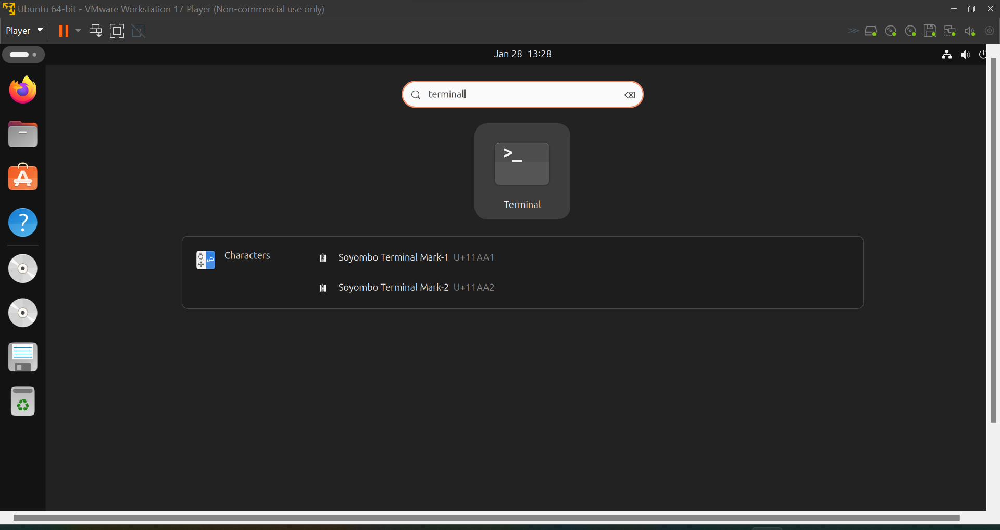
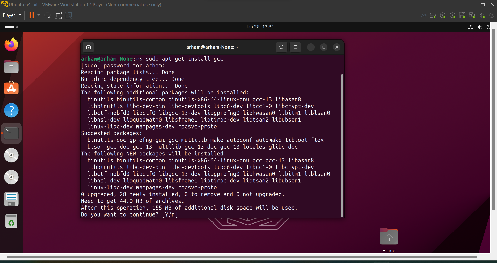
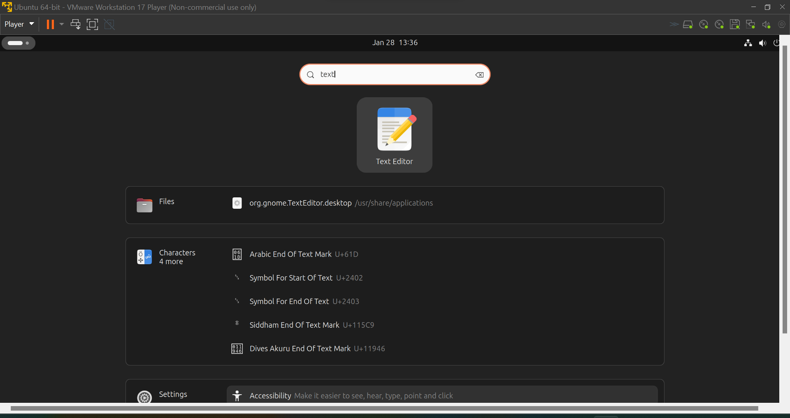
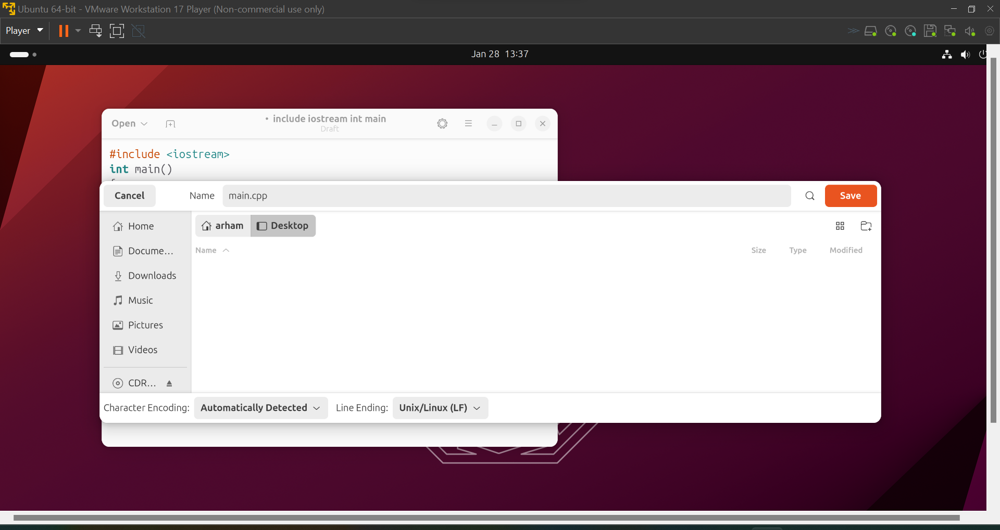
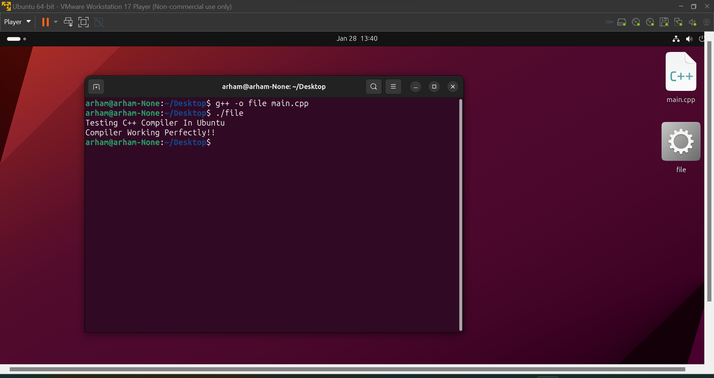

##### UET Lahore Department Of Computer Science   							 	Operating System Lab

##### Arham Imran 																	       2022-CS-209 

### 		Manual for installing C++ & C compiler in Ubuntu.

#### Step 1 => Open Terminal On Ubuntu

Open terminal on Ubuntu by clicking on the bar in the top left of home screen and typing 'terminal' on the search bar. 


#### Step 2 => Installing C++ and C compiler by terminal.

- Write command **"sudo apt-get install gcc"** and press Enter. It'll prompt you to enter [Y/n]. Type 'Y' to start installing C compiler. 

- Repeat the same process by by writing command "sudo apt-get install g++" to install C++ compiler.

#### Step 3 => Testing C++ & C compiler

- Open text editor by searching text editor in the search bar. 

- Write the following code in the text editor 
  ```c++
  #include <iostream>
  using namespace std;
  main()
  {
      cout << "Testing C++ Compiler in Ubuntu";
      cout << "Compiler Working Perfectly!";
  }
  ```

- Press "Ctrl" + 'Shift" + S and save the file by name "main.cpp". 

- Write "g++ -o main main.cpp" on the terminal to compile . And then write "./main" on the terminal to execute the file. 
  You should see the following on your terminal. 

- Repeat the same process for C language by writing the code 
  ```C
  #include <stdio.h>
  void main()
  {
      printf("Hello!, This is my first C program with Ubuntu.");
  }
  ```

  Save the file as test.c file, Compile the file by writing "gcc -o obj test.c", Then execute the file by writting ./obj on the terminal.
