#### UET Lahore Department of Computer Science

#### Operating System Lab

#### Arham Imran 	2022-CS-209

## Introduction to Ubuntu terminal commands

#### Echo (display text) : 

- 'echo' command is used to print anything on the terminal that you write after that command.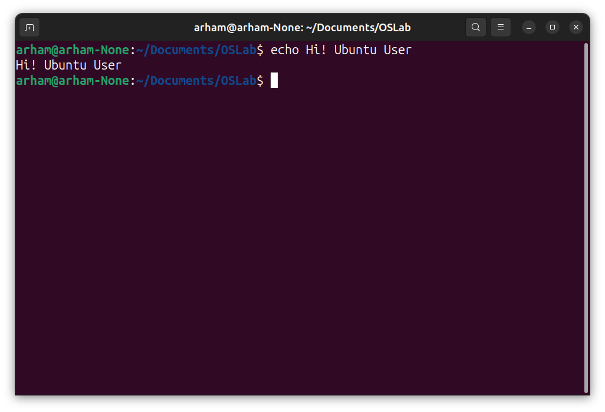
- 'echo -n' command is used to not move the prompt to the next line. 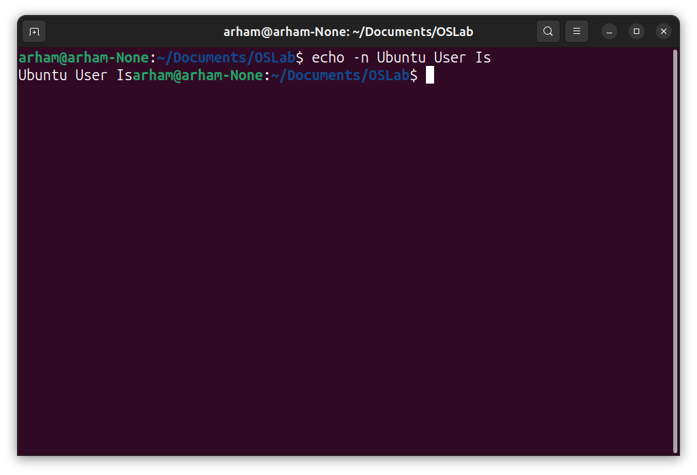

#### Uptime (system uptime) :

- uptime command is used to show current time, number of users, system load averages, and for how long the system has been used. 
  - '15:03:26' : Current Time
  - 'up 28 min' : The System has been up for 28 mins.
  - '2 users' : There are 2 users currently logged in.
  - 'load average : 0.62, 1.00, 1.05' : Load average(number of processes that are either in runnable or uninterruptible state) for last 1, 5, and 15 minutes, respectively.

#### PWD (Print-Working-Directory) :

- 'pwd' command is used to print working directory. It prints the current working directory, which is the directory you are currently in within the file system. 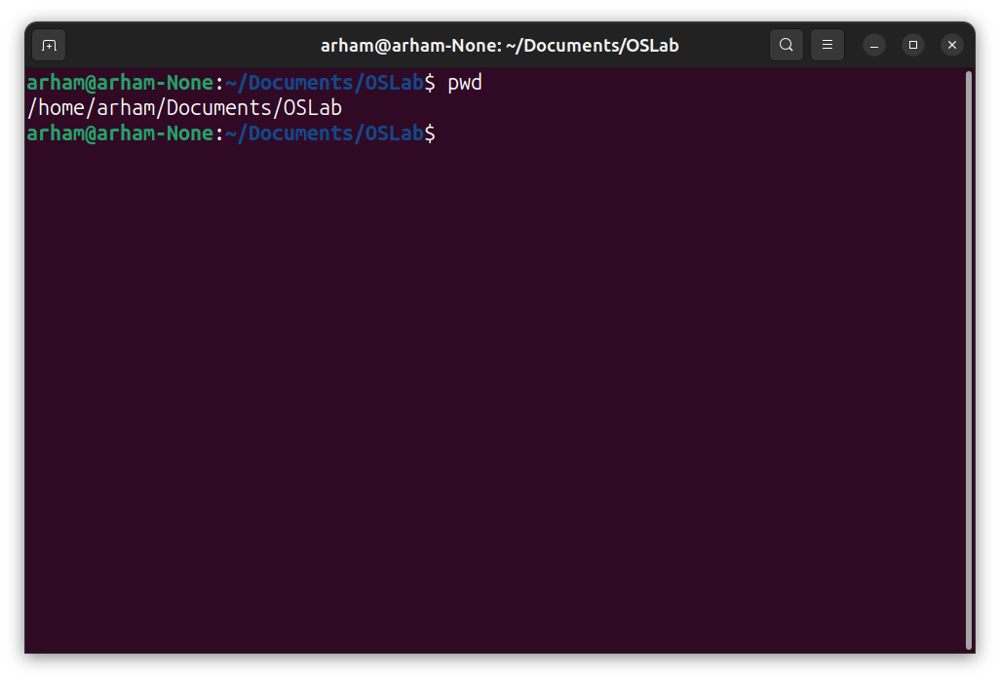
  - '/home/arham/Documents/OSLab' : Full path of the current directory you're in.

#### Mkdir (make directory) :

- 'mkdir' command is used to create directory. 
  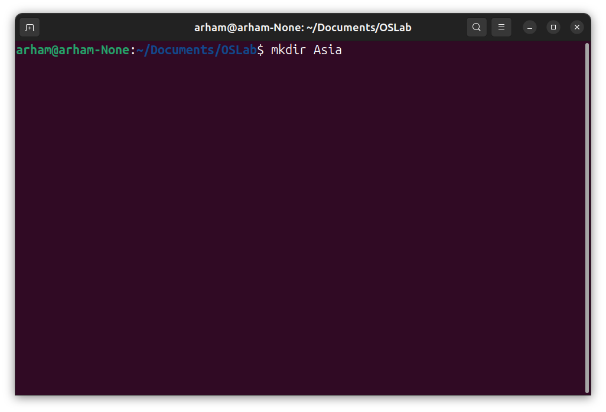
  - 'mkdir asia' : creates a directory of name 'asia' inside the current working directory.
- 'mkdir' command can also be used to create multiple directories. 
  - 'mkdir Europe Africa America' : creates three directories Europe, Africa, and America inside the current working directory.
- 'mkdir -p' is used to create a directory inside a directory that also is not created. You can also use 'mkdir' only to create a directory inside a directory that is in the current directory. 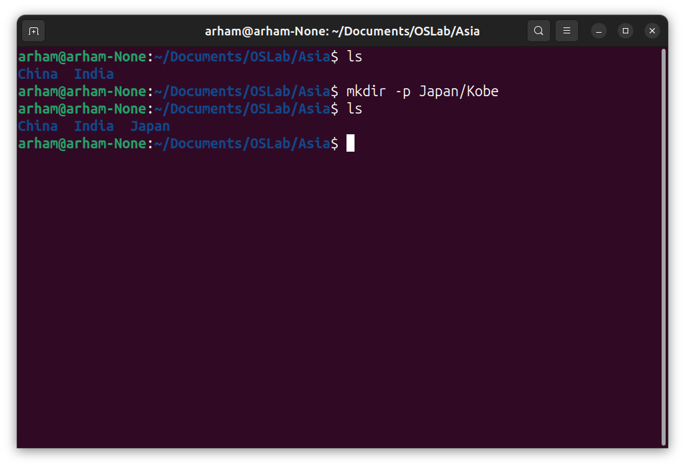
  - 'mkdir -p Japan/Kobe' : creates a directory 'Japan' inside the current directory and 'Kobe' inside the directory 'Japan'.

#### Ls (List) :

- 'ls' command is used to list the files and directories in the current directory. 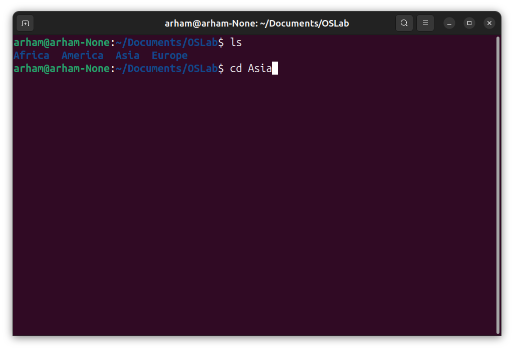
- 'ls [directory path]' : You can also view directories and files inside the directory by giving the 'absolute' or 'relative' path of the directory after ls command. 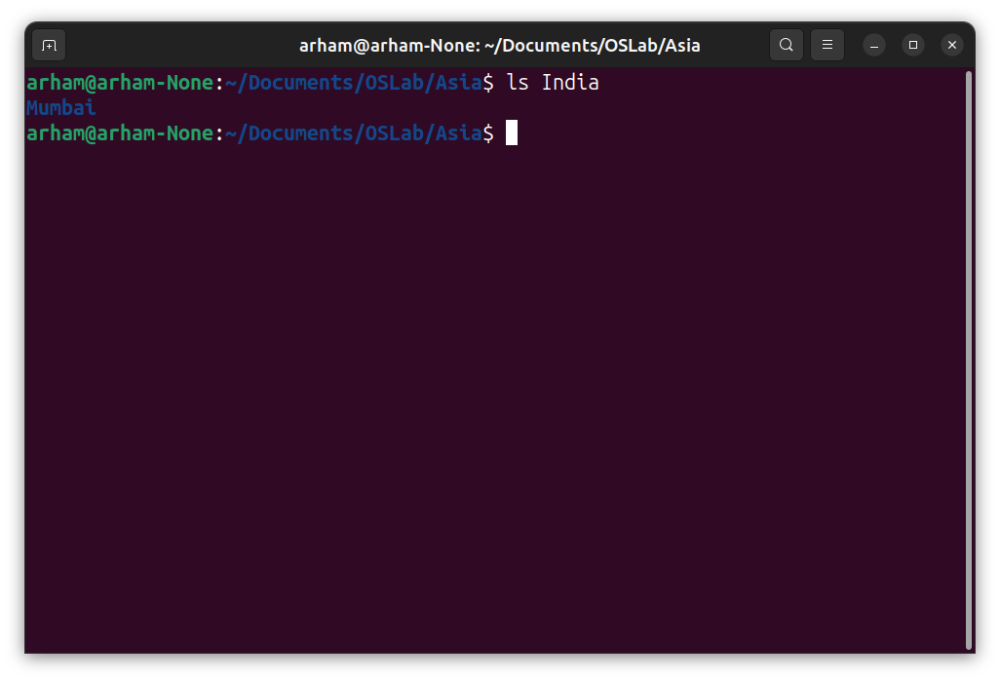
- 'ls -a' lists all the files and directories including the hidden files.
- 'ls - l' command is used to list files and directories in long format. 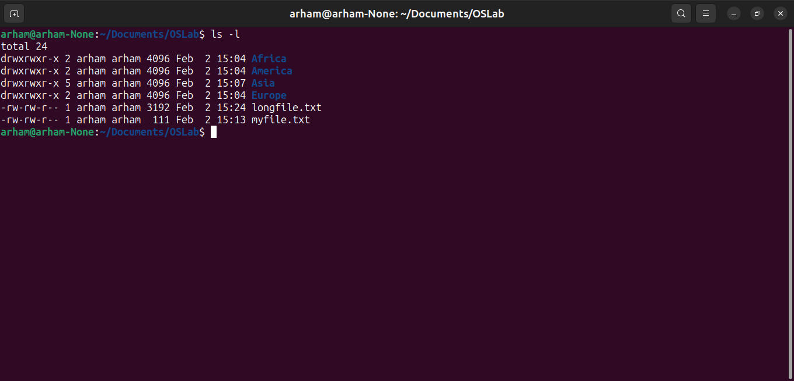
  - File Type and Permissions(e.g., 'drwxrwr-x') : indicates the type of file(directory, regular , etc.) and the permissions for the owner, group and others.
  - Number of Links : Displays the number of hard links to the file or directory.
  - Owner : Owner of the directory or file.
  - Group : Group associated with the directory or file. 
  - File Size : Size of the file.
  - Modification Time: Date and Time when the file or directory was last modified.
  - Name : Name of the file or directory.
- 'ls -lt' is used to show files in long format but files appears sorted by the modification time(t). The most recently modified files will appear at the top. If you want to include hidden files also you can add 'ls -lta'. 
  - Most recently modified file is at the top, And so the trend continues.
- 'ls -ltr' is used to list files and directories in long format, sorted by modification time(t) in reverse order(r), with the newest files appearing at the bottom. 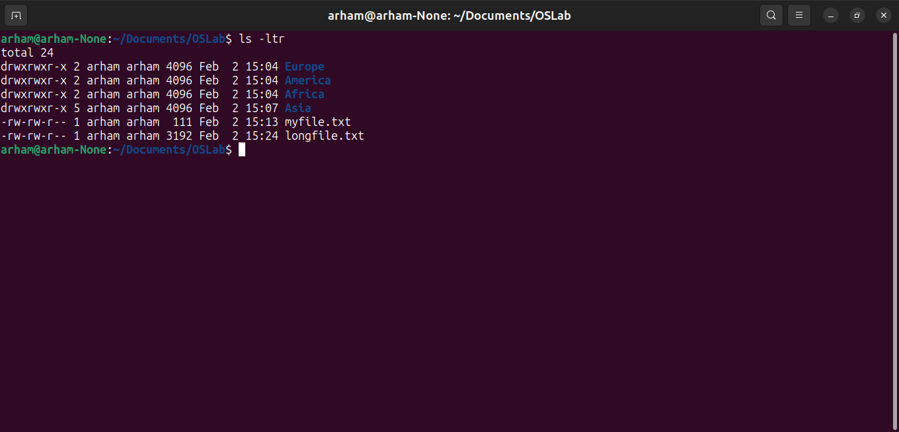
  - Most recently modified file is at the bottom.

#### Whatis (short description of a specified command) :

- 'whatis' command is used to display a short description or one-line summary of a specified command. 
  - 'whatsi date' displays the description of command date.

#### Man (Display documentation of a command) : 

- 'man' command is used to display the manual pages for a specified command. Manual pages provide information about command, utilities, and system calls. 
  -  'man date' command shows the documentation of date command.

#### Help (Display information about built-in shell) :

- 'help' command is used in the shell to displey information about buil-in shell commands. It provides summary of the syntax and usage of shell commands. 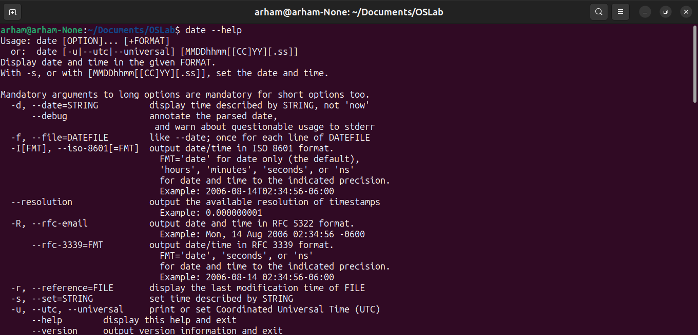
  - 'date --help' command shows information about command 'date'.

#### Whoami(Display user name) :

- 'whoami' command is used to display the username of the current user. 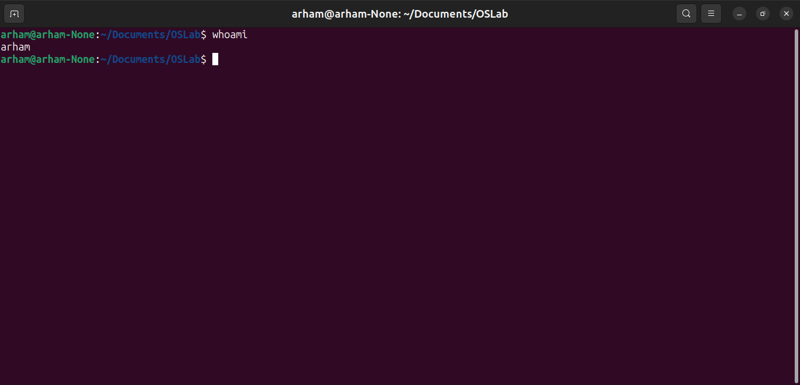
  - 'whoami' : Displays current username 'arham'.

#### Cd (Current directory) :

- cd [directory path] : It will take you to the provided path directory. 
  - 'cd /home/arham/Documents' : Takes the current directory the Directory Documents.
  - 'cd OSLab' : Takes the current directory to the 'OSLab' directory that is inside Documents.

#### Touch (Create empty file or update the timestamp) :

-  'touch' command is used to create a new file or update the timestamps(access and modification times) of existing files. 
  - 'touch myfile.txt' creates a new file file with name myfile.txt. 
- 'touch existingfile' will update the time stamp of the file name 'existingfile'.

#### Which (Locate executable file) : 

- 'which' command is used to locate the executable file associated with the given command. 
  - 'which pwd' : prints the location of the executable file associated with command 'pwd'.

#### Cat, Head, Tail (Prints File Content) : 

- Cat command prints all the data inside the file on the terminal.
- Head command is used to display the beginning (head) portion of a file. Be default, it shows the first 10 lines of a file. You can specify number of lines using -n option.
- Tail command is used to display end(tail) portion of a file. By default, It shows the last 10 lines of a file. You can specify the number of lines by using '-n' option.
- 
  - 'cat myfile' prints all the content in the file 'myfile.txt'.
  - 'head -1 myfile.txt' prints the first line of the file 'myfile.txt'.
  - 'tail -1 myfile.txt' prints the last line of the file 'myfile.txt'.
  - 'tail -2 myfile.txt' prints the last two lines.
  - 'head -2 myfile.txt' prints the first two lines of the file.

#### More (Display file content) : 

- 'more' command unlike 'cat' which displays all the content of the file. More command lets you navigate through the file interactively.
  - 'more new_file.txt' will open the file content and show on termina.
  - [Space] - scrolls the display, one screenful of data at a time.
  - [Enter] - scrolls the display by online.
  - [b] - scrolls the display backwards one screenful of data.
  - [/] - search for data.
  - Using More command.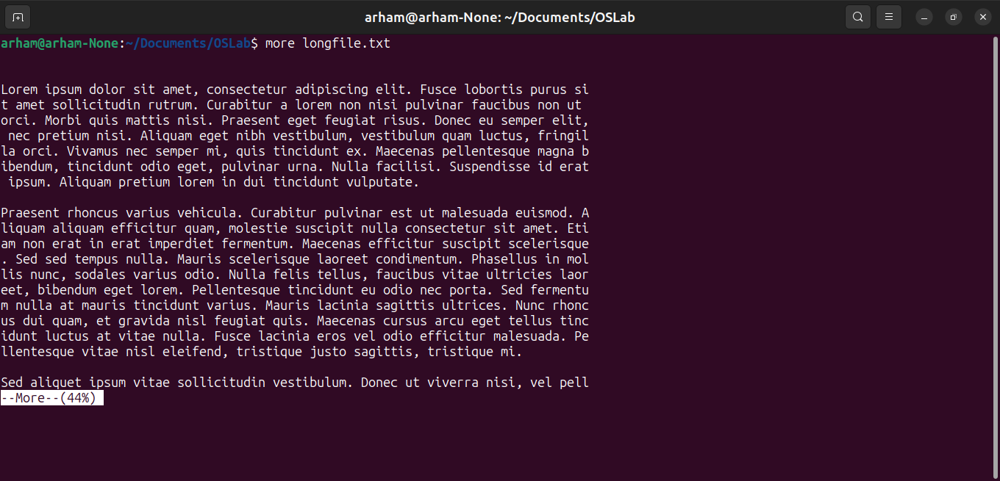
  - After Pressing 'Enter'. 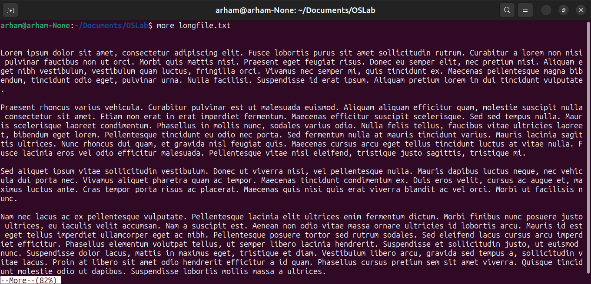

#### Less (Improved Version of more) : 

- 'less' command is a improved version of more command. 
  - 'less filename' will open the file with name 'filename'.
  - [Up Arrow] - Scrolls up the display one line.
  - [Down Arrow] - Scrolls down the display one line.
  - [/] - search text.
  - After writing 'less filename' command.  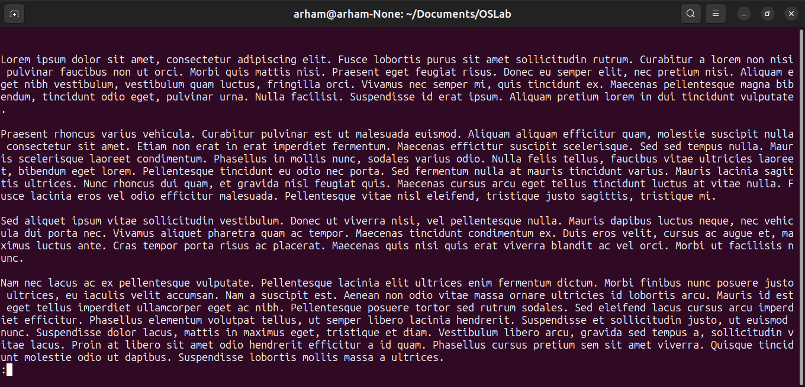
  - Searching for word in 'rutrum' by writing /rutrum command. 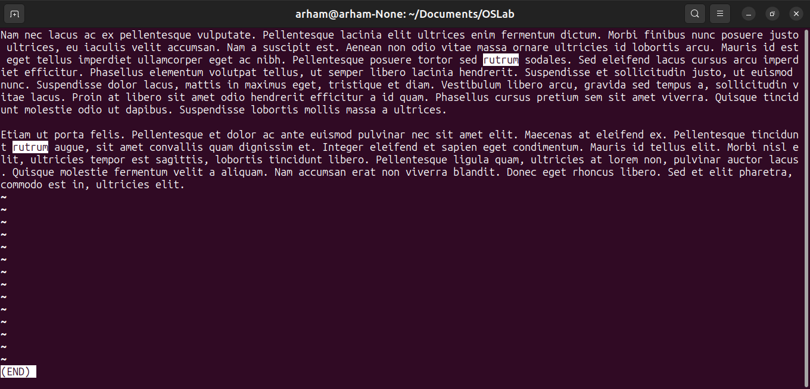

#### Nano (Text editor) : 

- 'nano filename' will open a terminal based text editor to edit file content.
- By writing 'nano myfile.txt' will open text editor allowing us to edit the file content. 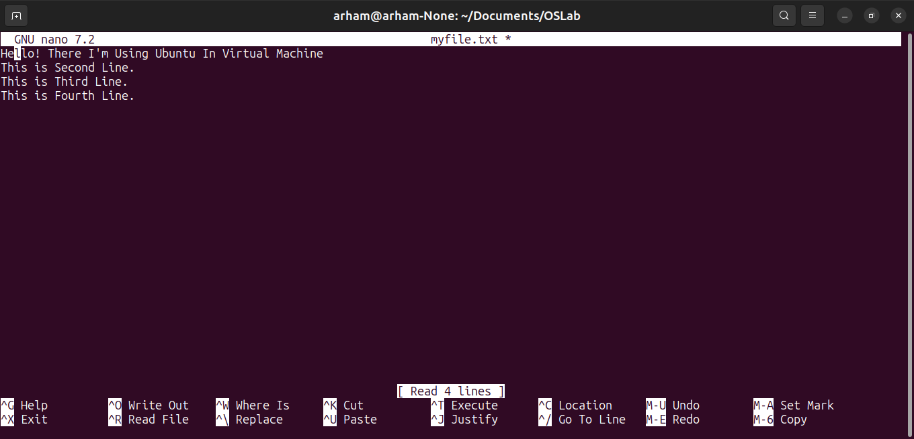

#### Id (Display information about user) :

- 'id' command is used to display information about user. 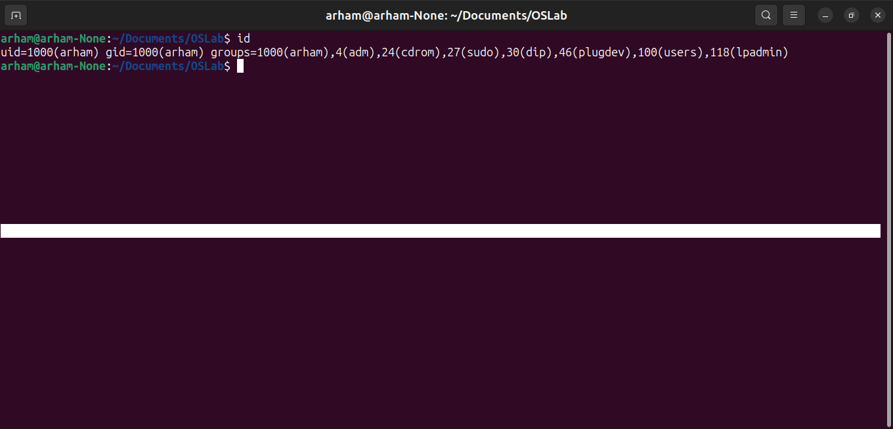
  - UID - User id.
  - GID - Group id.
  - Supplementary groups.
  - Other details.

#### Who (Display information of current user) : 

- 'who' command is used to display information about current user. 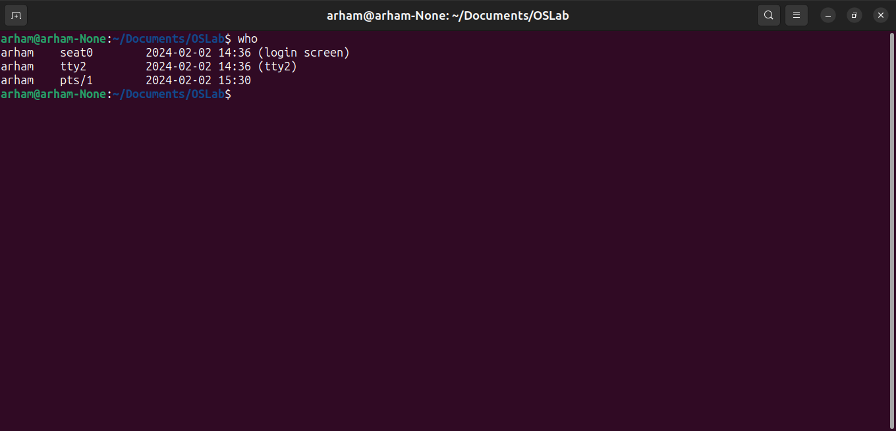
  - 'arham' user is logged in on the local terminal 'seat0'.
  - 'arham' user is logged in terminal 'tty2'.
  - 'arham' user is logged in pseudo-terminal 'pts/1' from different IP address.

 #### Last (Display recently login user details) :

- 'last' command is used to display recently logged-in users and their login sessions. It shows information about username, terminal, IP address, login time, and duration of the login session. 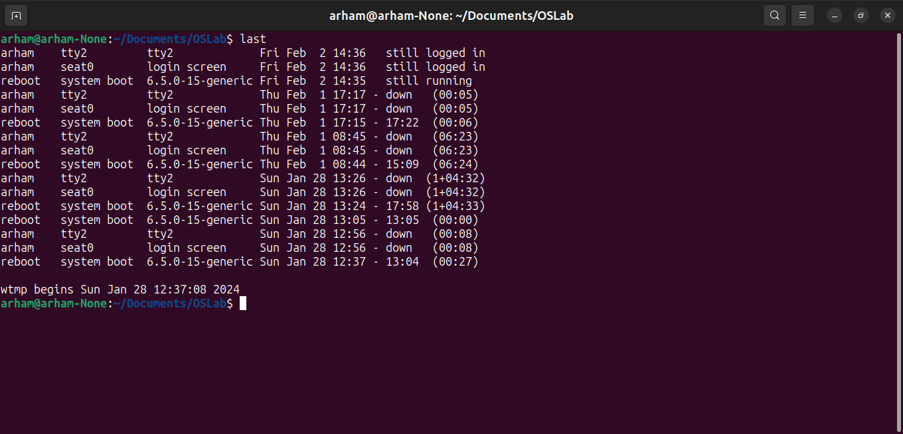

#### Sudo (Super User Do) :

- 'Sudo' is a command used to execute commands with superuser(root) privileges. 

#### User and Group Management

- User and Group management involves creating, modifying, and deleting user accounts and groups.
- 'adduser username' is used to create a new user with the specified username.
- 'useradd -m username' is used to create a new user and also creates its home directory.
- 'groupadd groupname' creates a new group.
- 'groupdel' will delete the group.
- 'userdel username' will delete user.
- 'passwd username' will allow to change password.
- 

#### Access Control files in Linux

- /etc/passwd contains users information. 
- /etc/shadow contains hashed passwords.
- /etc/group contain group information. 

#### File Permissions

- File permissions determine who can access a file or directory, and what actions(read, write, or execute) they can perform on it. File permissions are represented by a combination of three sets of permission flags for the owner, group and others(everyone else).
- There are three file permissions Read('r'), Write('w') and Execute('x').
- File permissions are represented by 10-character string. The first character indicates the file type, and the next three sets of three characters each represent the permissions for the other, group, and others.
- In the following example that is output of 'ls -l' shows the permission 
  "-rw-r--r-- 1 user group 1024 Feb 2 12:34 myfile.txt" 
  - The first character '-' indicates that it is a regular file.
  - 'rw-' represents read and write permission and no execute permission for the owner.
  - 'r--' represents read only permission for the group.
  - 'r--' represents read only permission for the others.
- File permission can also be repsented by octal values where
  - Read(r) : 4.
  - Write(w) : 2.
  - Execute(x) : 1.
  - No Permission(-) : 0.

#### Chmod (Change permission) :

- 'chmod' command is used to change permissions of files and directories.
- The syntax of chmod command is 'chmod [options] [permissions] [filename]'.
  - Options : Optional parameter that modify the behavior of chmod.
  - Permissions : Desired permissions, Specified using symbolic or numeric representations.
  - Filename : Name of the file or directory whose permissions you want to change.
- In Symbolic representations, you can use letters and symbols to represent the permissions. The format is who + operator + permissions. 
  - who can be 'u' user, 'g' group, 'o' others, and 'a' all equivalent to 'ugo'.
  - operator can be '+' (add permission), '-' (remove permission), or '=' (set exact permission).
  - 'permissions can be 'r' (read), 'w' (write), or 'x' (execute).
  - Example 1 : 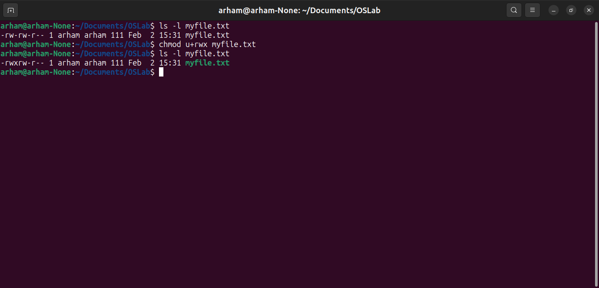
    - Here 'chmod u+rwx myfile.txt' allows the user permissions to read, write and execute myfile.txt.
  - Example 2 : 
    - Here 'chmod ugo+r-x myfile.txt' allows user, group and others to have read permission but not have execute permission.
- In Numeric representation, each permission is assigned a number.
  - '4' for read, '2' for write, and '1' for execute. You add these values to represent the desired permission. Like 'chmod 644 filename' represents read and write permissions for owner, read-only for the group and others. 
  - Example 1 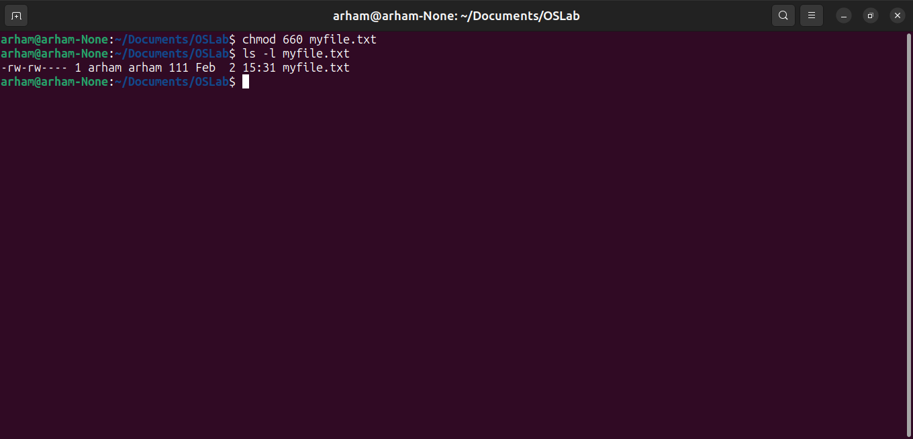
    - 'chmod 660 myfile.txt' : Allows read and write for user and group and no permission for others for file 'myfile.txt'.
  - Example 2 
    - 'chmod 750 myfile.txt' : Allows read, write and execute permissions for user, read and execute for group and no permission for others.

#### Chown (Change owner) :

- 'chown' command is used to change the ownerchip of the files and directories.
- The syntax of chown command is 'chown [options] new_owner[:new_group] file(s)'.
  - new_owner : The new owner's username.
  - new_group : (Optional) The new groups name.
  - file(s) : The file(s) or directory(ies) for which you want to change ownership/.
- Example 
  - 'chown arham myfile.txt' : This command changes the owner of 'myfile.txt' to the user arham.

#### Chgrp (Change group) :

- 'chgrp' command is used to change the group ownership of files and directories. 
- Syntax is 'chrgrp [options] new_group file(s)'.
  - new_group : The name of the new group.
  - file(s) : The files or directories you want to change group ownership.
- Example 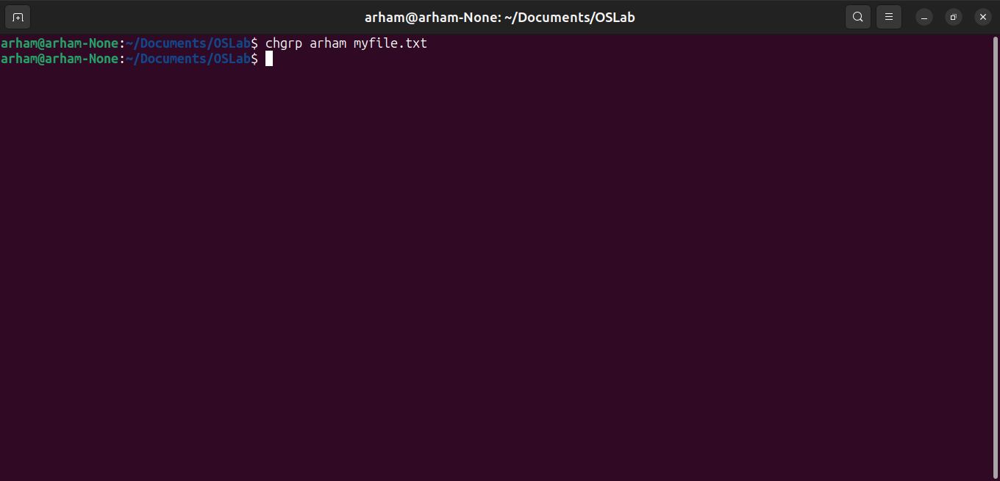
  - 'chgrp arham mytext.txt' : Changes the group ownership of 'myfile.txt' to the group arham.
