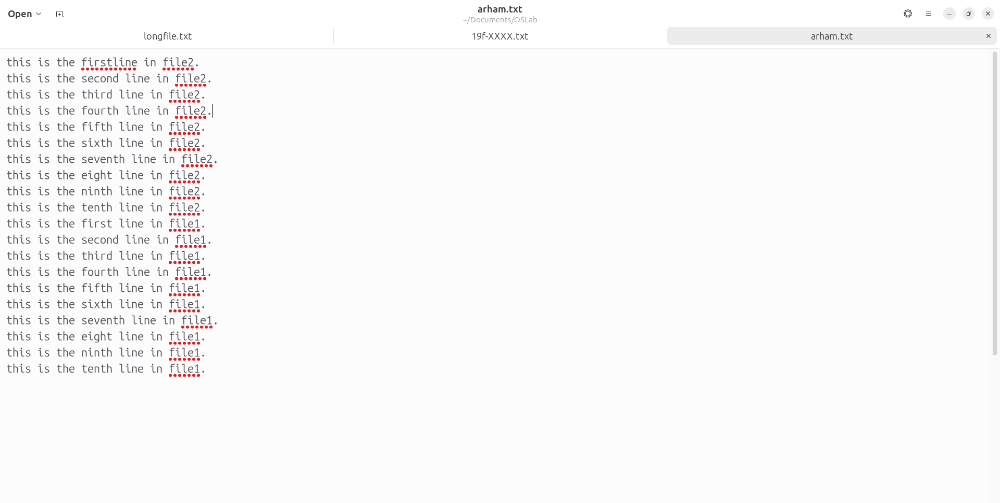

### UET Lahore Department of Computer Science

### Operating System Lab

### Arham Imran 	2022-CS-209

# Lab Tasks - Lab # 3

## Task : 1 

#### Task 1.1 : Creating a file '19-XXXX.txt'. File must contain at least 10  Lines

- Open Terminal in the folder where you want to create a file. 
  - Open File Manager.
  - Navigate to the folder where you want to create a file.
  - Click right click and on options select 'Open Terminal'.
- Write "touch '19-XXXX.txt'" on the terminal to create a new file.
- To write onto file you can open nano editor by typing the command "nano [filename]", where [filename] is the name of the file you want to open. In our case write the following command. 
- The following text editor will open. You can now edit the file content on this terminal based text editor. 
- After writing the content, To save what you have written press "Ctrl + X". 
- Enter 'Y' to save the content. 
- Enter 'Y' to save the content into the file.
- File content will saved into file '19F-XXXX.txt' 

#### Task 1.2 : Create another file named "your name.txt". File must contain at least 10 lines.

- You can use the same procedure defined in Task 1.2 to create another file and write content into it.

#### Task 1.3 & Task 1.4 : Merge The data of both files and save the output to a new file

- You can merge the data of two files by using the command 'cat [file1name] [file2name] > [newfilename]', Where [file2name] is the name of the file whose data you want to merge or write at the end of the [file1name] name of the file. 
- You can also use 'cat [file1name] > [file2name]' to merge data of file1name at the end of file2name.
- Let's Look at the file 'arham.txt' that now also contains data of '19F-XXXX.txt'. 

#### Task 1.5 : Display first two lines of first file.

- You can Display first by using 'head' command. 
  - 'head filename' : Prints the first 10 lines of the file.
  - 'head -n filename' : Prints the first n lines of the file.
- 'head -2 19f-XXXX.txt' : Prints the first two lines of the first file '19f-XXXX.txt'. 

#### Task 1.6 : Display last two lines of the second file.

- You can use 'last' command to display last lines of the file.
  - 'last [filename]' : Will print the last 10 lines by default of the file by the name 'filename'.
  - 'last -n [filename]' : Will print the last n lines of the file by the name 'filename'.
- 'tail -2 arham.txt' : Prints the last two lines of the file arham.txt.

#### Task 1.7 : Find string in the first file.

- 'less' command is used to view files with additional features provided in it. You can also use less command to search for a pattern in the file content.
- To use less command. Type 'less [filename], Where filename is the name of the file. 
- Type 'less 19f-XXXX.txt' on the terminal to open the file. 
- The following window will  be opened. 
- type /2022-CS-209 to search for the string '2022-CS-209' in the file. And press Enter. Pattern will be highlighted if it is present in the file. 

#### Task 1.8 :  Execute Permission of the second file to the group.

- To check the permissions of the file. Type 'ls -l [filename]', where filename is the name of the file.
- There are three types of permission. Read (r), Write (w), Execute (x). types types User(u), Group(g) and Other(o) and a(all). 
- You can give permission by writing command 'chmod type [+/-] permission' on the terminal, where type is user, group, other, all and [+/-] are symbols for add, or remove permission(s) and command is read, write and execute combinations.
- To give execute permission of the second file to the group. Type 'chmod g+e  arham.txt'.
  - Chmod : command to change permission.
  - g+e : Add execute permission to group.
  - arham.txt : name of the file.
- 

#### Task 1.9 : Remove Write Permission for the owner.

- To remove the write permission for the owner. Similar to Task 1.8, you can use chmod to remove permission.
- Check the previous permissions of arham.txt by typing 'ls -l arham.txt'. 
  - Here the highlighted 'rw-' represents permission for user. Currently user has read and write permission only.
- Type 'chmod u-w arham.txt' : Removes write permission for the user.
  - chmod : Command to change permission.
  - u-w : Remove write permission for user.
  - arham.txt : Name of the file whose permission you want to remove.
- After the command you can see in the highlighted text user now has all the permissions. 

#### Task 1.10 : Find current location.

- You can use 'pwd(Present Working Directory)' command on terminal to get the absolute path of the current working directory.
- type pwd on terminal to get the path of current directory. 

#### Task 1.11 : List files on Desktop Directory

- 'ls directory_path' command is used to show files and directories in the given directory path "directory_path". 
- Write 'ls /home/[username]/Desktop/', ([username] is your ubuntu username) to print the files and folder on the desktop directory. 

 #### Task 1.12 : Create a folder for his personal files and pictures

- 'mkdir [foldername]' (Where foldername is the name of the folder you want to create) is used to create a folder in the current working directory.
- "mkdir '2022_CS_209'" will create a folder with name '2022-CS-209'. 

#### Task 1.13 Display current time

- You can display current time using command 'date' on terminal. 

#### Task 1.14 : Display a thankyou message.

- 'echo message' command is used to print message on the termina.
- 'echo -e message' command is used to add '\n' (endline character) on the message so that when it is encountered terminal moves to the next line.
- 'echo -n message' command will not move to the next line after the message is printed. 
- 

## Task 2

#### Task 2.1 : Create a file named "19f-XXXX_OS-lab_rules.txt" using Linux commands.

- 'touch [filename]' command is used to create a file with the name [filename]. 
- 'echo -e [data] > [filename]' (where [data] is the text you want to enter in filename and [filename] is the name of file in which you want to add) is used to enter data into the file. 
- The following command adds lab rules to the file '19f-XXXX_OS-lab_rules.txt'. 
- Text is added in the file. 

#### Task 2.2 : Set rights of created file to (- rwx r-x r--) using numeric format.

- In numeric format. Read(r) is represented by 4, Write(w) is represented by 2, and Execute(x) is represented by 1. You when you want to change permission like 'rwx' it becomes (4+2+1) = 7 or 'r-x' that becomes (4 + 1) = 5. 
- The first value 'rwx' represented 'user' permission.
- The second value 'r-x' represents 'group' permission.
- The third value 'r--' represents 'others' permission.
- To represent this whole permissions you have to create 3 digit number that represents all this permission, The first digit for user 'rwx' will be 4+2+1 = 7, The second digit for group 'r-x' will be 4+1 = 5,  and the third digit for others 'r--' will be 4. So your digit will be 754.

#### Task 2.3 : Change file permission.

- 'chmod [permission] [filename]' command is used to change permission, Where [permission] is the permission format for user, group and others. And [filename] is the name of the file that you want to change permission.
- Highlighted text represents the previous permissions. 
- 'chmod 754 19f-XXXX_OS-lab_rules.txt' : Will change the permission. 
  - Highlighted text shows the new permissions.

#### Task 2.4 : Append ls command input.

- 'echo [command] >> [filename]' command is used to save command output on a file, Where [command] is you desired command and [filename] is the name of your desired file.
- 'echo ls -l 195-XXXX_OS-lab_rules.txt >> 19f-XXXX_OS-lab_rules.txt' will save ls command output in the file. 
  - 'ls -l 19F-XXXX_OS-lab_rules.txt' is the command.
  - '>>' is the operator to store output.
  - '19F-XXXX-OS-lab_rules.txt' is the file name in which to store.
- File contains ls command output. 
