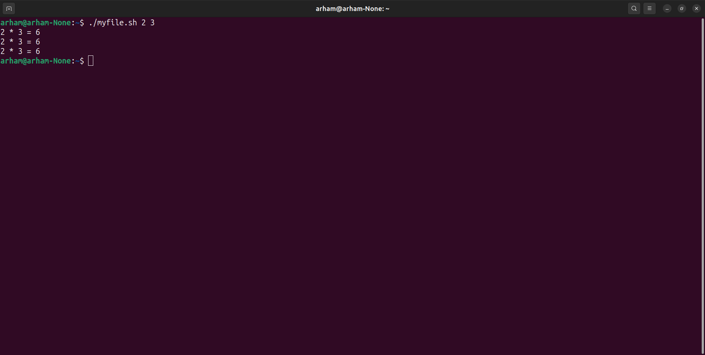
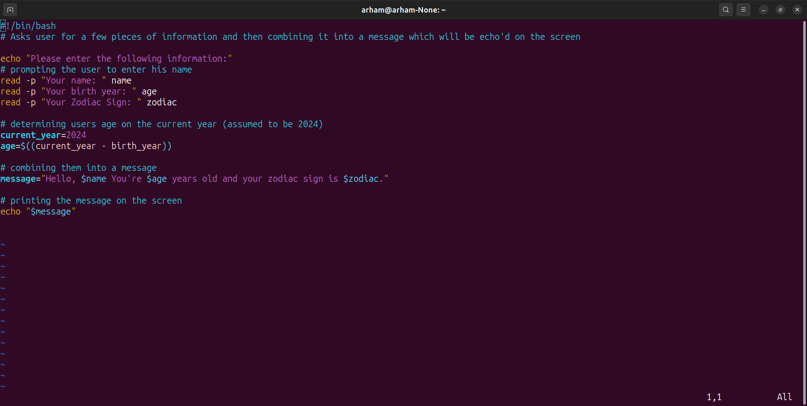
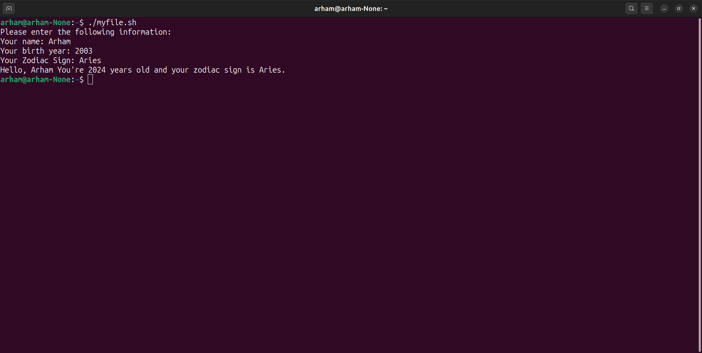
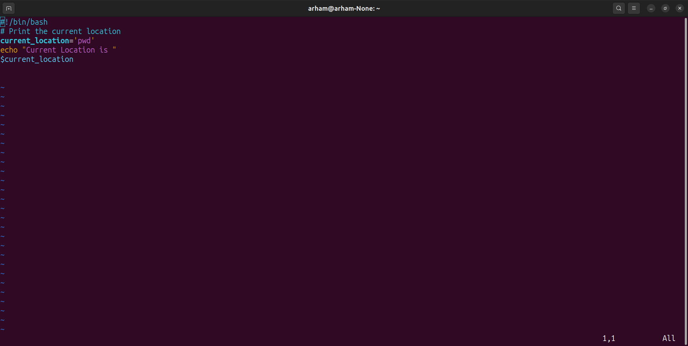
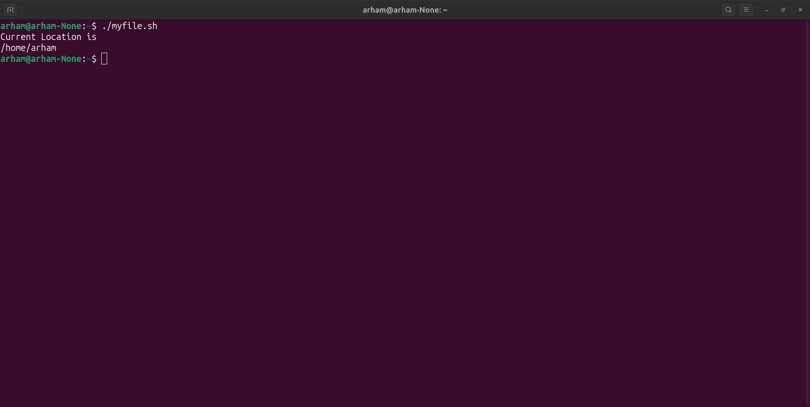
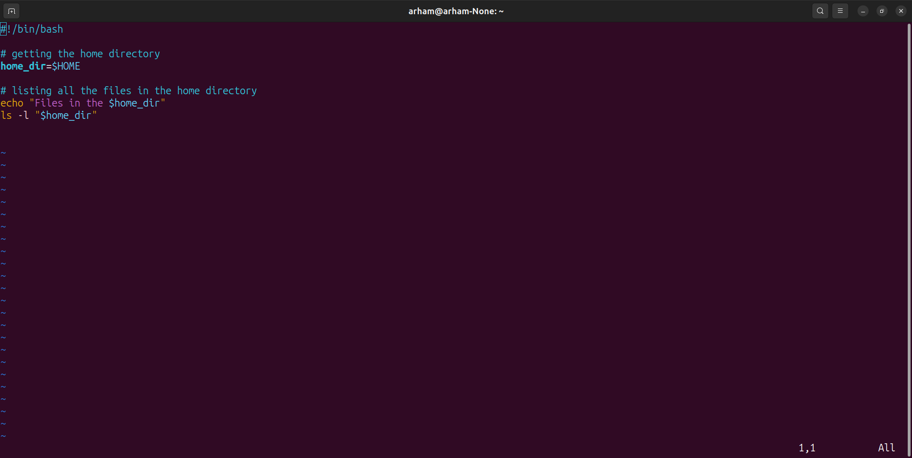
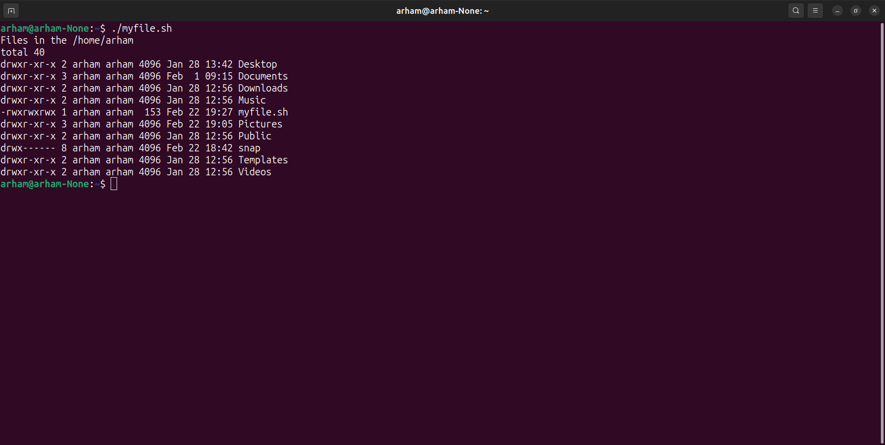
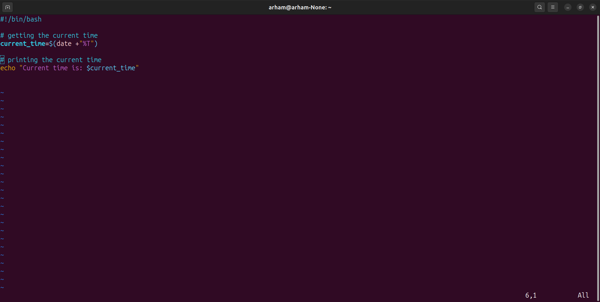
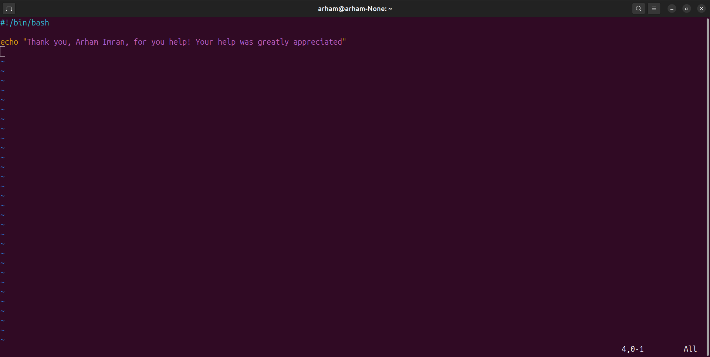
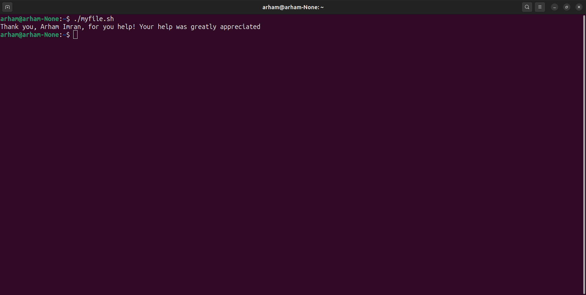

### Lab 4 Operating System Tasks

### **Arham Imran 2022-CS-209**

#### Task 1.1 : Create a script to take two command line arguments and multiply them

- Variables are declared by using **''[variablename]=[variablevalue]'**(where [**variablename**] is the name of the variable and [**variablevalue**] is the value assigned to it).
- $1, $2, .. are the **parameters** given to the scripts that are passed through the command line terminal.
- So you can use $1 to use first argument and $2 to use second argument..
  - You can use three ways to use the argument. 
  - In the first way two variables a and b are used to store first and second argument. Then c is used to store the result of that. The expression **c=(( $1 * $2 ))** is used to multiply first and second argument values and stores them in the variable c. Then on the next line echo function is used to print the value of c on the terminal.
  - In the second way both of the arguments are directly evaluated and stored in variable c.**"c=$(( $1 * $2 ))"** directly multiplies first and second argument and stores them in the result.
  - In the third way no variable is used. The expression is directly evaluated in the echo command.
- In the execution of the script arguments are passed by writing the file execution command then writing the two arguments separated by space. .

#### Task 1.2 :  Create a simple script which will ask the user for a few pieces of information and combine them into message and echo'd them on the screen.

- You can use **echo [message] ([message]** can be anything string, integer, variable, etc.) command to print any thing on the console.
- Read command is used to receive a value from the user and store it in the variable.
  - **read [variablename]** : Asks the user for a value and stores it in the variable named by [**variablename**].
  - **read -p [prompt] [variable]** : Shows the user [prompt] when asking for a variable value.
- You can combine the variable values in the string by using '$' at the start of the variable name in the string.
- The following code asks user for his name, birth year and zodiac sign, calculates his age and stores them in the variable **message** and prints it..
- The following is the result when we run the bash file. .

#### Task 1.3 : Current Location

- In Linux '**pwd**' command returns the current location. .
  - The command 'current_location='pwd'' stores the string pwd in current_location variable
  - $current_location writes 'pwd' on the script file.
  - When the script is executed 'pwd' command is executed and present working directory is printed on the screen as shown. .

#### Task 1.4 : List all the files present on the home directory

- **$HOME** contains the address of the home directory.
- you can use ls -l $HOME to show all the files in the home directory. .
  - '**home_dir=$HOME**' stores the location of the home directory.
  - **ls -l "$home_dir"** prints all the files present in the home directory.
- Output when executing the script. .

#### Task 1.5 : Display the current time

-  '**date**' command is used to print current date and time.
- You can use **date + "%T"** to get the current time from the date command. .
  - **'current_time=$(date +"%T")'** retrieves the current time from the date command and stores it in the current_time variable.
  - **echo 'Current time is: $current_time'** : prints the string "Current time is" and the value stored in current_time which is the current time.
- Output of the file code. .

#### Task 1.6 : Write a thank you message.

- You can use **echo "[message]** ([message] is the text you want to write)" to write anything on the console.
- .
- Output of the file. .
