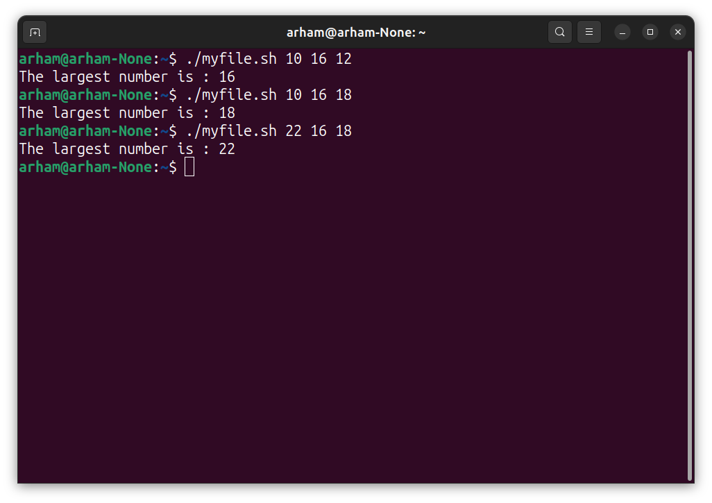
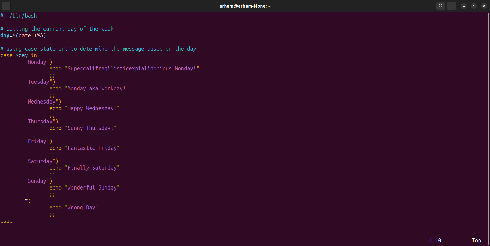
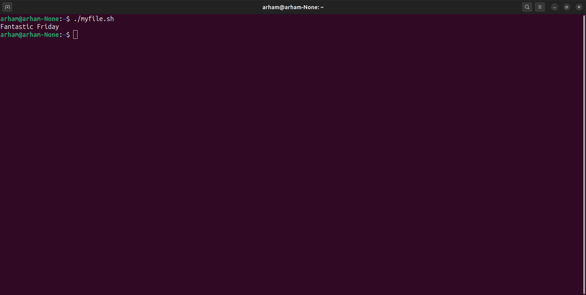

#### Department of Computer Science UET Lahore

#### Operating Systems Lab

#### Arham Imran (2022-CS-209)

### Lab 5 Task 1

#### Task 1.1: Create a Bash script which will take 3 numbers as command line arguments. It will print to the screen the larger of the three number

- **Code Screenshot**: 
- **Code Output**: 

#### Task 1.2: Create a Bash script that will print a message based on which day of the week it is (e.g., 'Happy day' for Wednesday, 'blessed' for Friday, etc.) using a switch statement.

- **'date +%A'** command is used to get the day of the week. Where **'+%A'** is used to get full name of the day of the week like "Monday", "Tuesday", etc. The following are some more commands that you can use instead of ''+%A' with date.

  - **%Y**: Year (4-digit) 

  - **%m**: Month (01-12) 

  - **%d**: Day of the month (01-31)

  - **%H**: Hour (00-23)

  - **%M**: Minute (00-59) **

  - **%S**: Second (00-60) 

  - **%A**: Full weekday name (e.g., Sunday, Monday) 

  - **%a**: Abbreviated weekday name (e.g., Sun, Mon) **

  - **%B**: Full month name (e.g., January, February) 

  - **%b**: Abbreviated month name (e.g., Jan, Feb) **

  - **%j**: Day of the year (001-366) 

  - **%U**: Week number of the year, with Sunday as the first day of the week (00-53) **

  - **%W**: Week number of the year, with Monday as the first day of the week (00-53) 

  - **%Z**: Timezone (e.g., PST, EST) - **%z**: Timezone offset from UTC (e.g., -0800)

- **Code Screenshot**: 
- **Code output**: 

