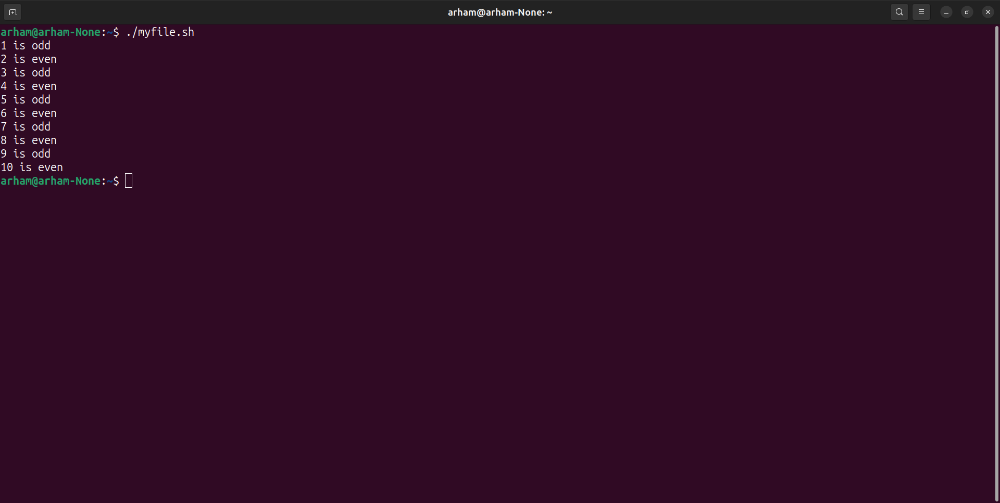
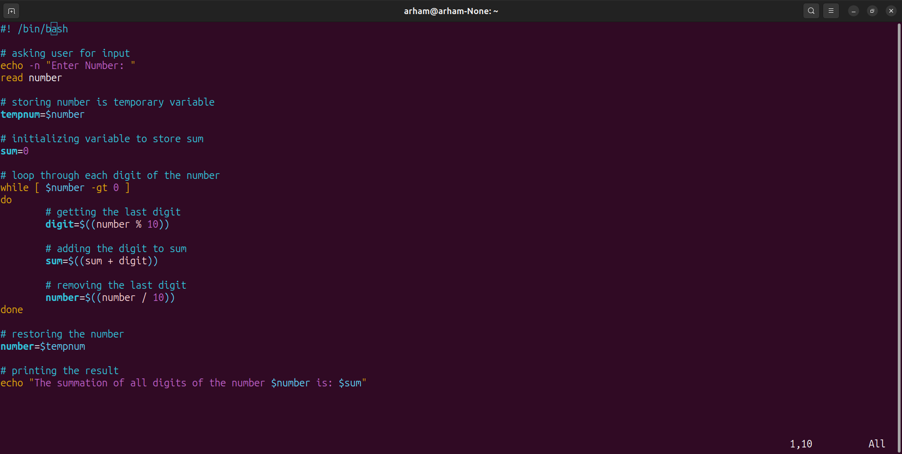
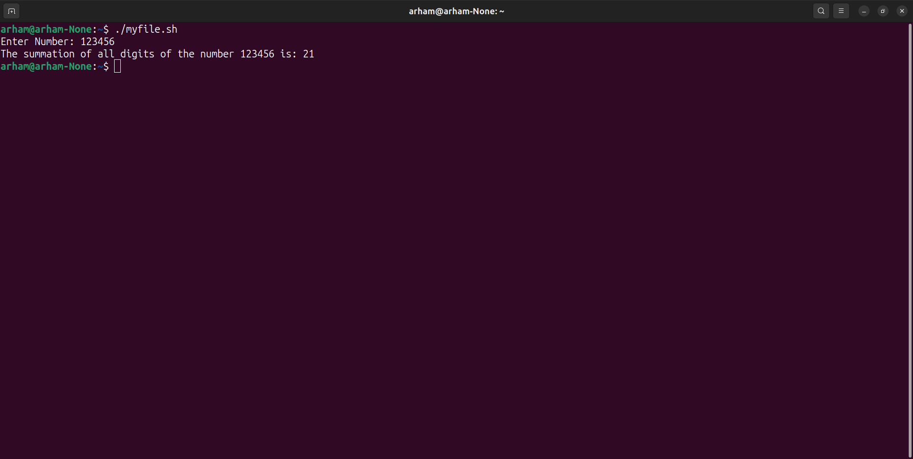

#### Department of Computer Science UET Lahore

#### Operating Systems Lab

#### Arham Imran (2022-CS-209)

### Lab 5 Task 2

#### Task 2.1: Create a simple script which will print the numbers 1 - 10 ( each on a separate line) and whether they are even or odd.

- **Code Screenshot**: 
- **Code Output**: 

#### Task 2.2: Write a program that reads number as input, calculate and returns the summation of all the digits of the number. (Example: if given : 745, Then result is (7+4+5) = 16.)

- **Code Screenshot**: 
- **Code output**: 

