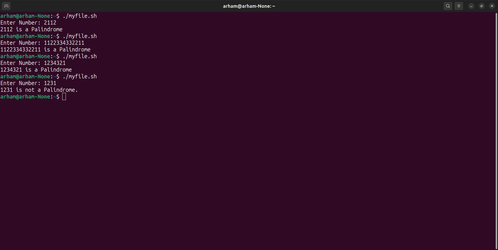
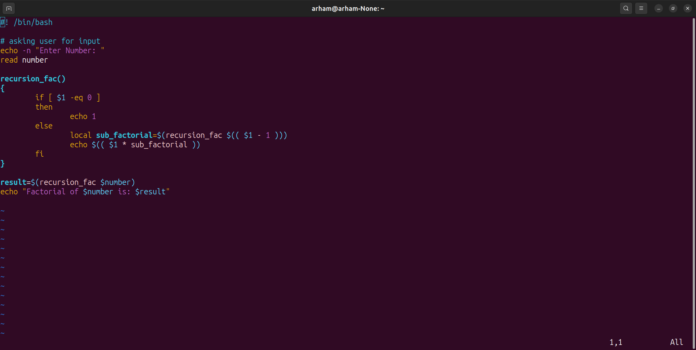
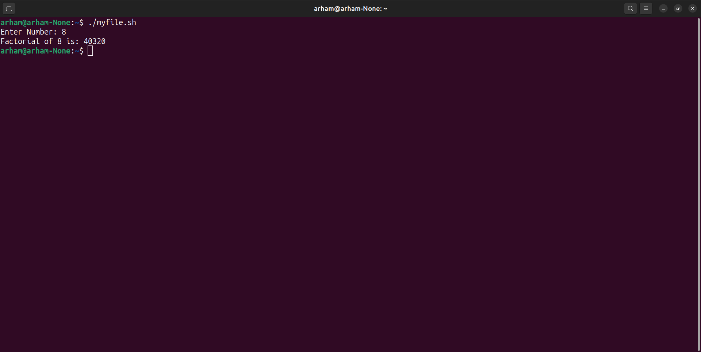

#### Department of Computer Science UET Lahore

#### Operating Systems Lab

#### Arham Imran (2022-CS-209)

### Lab 5 Task 3

#### Task 3.1: Write a shell script which takes a positive number as argument and checks if it's a palindrome by first reversing it for that create a reverse() function then use palindromeCheck() function then compare number with its reverse to check it's a palindrome or not.

- **Code Screenshot**: 
- **Code Output**: 

#### Task 3.2: Write a shell script which reads a number from the user and passes it to a function name factorial(). this This function finds the factorial of the number using recursion.

- **Code Screenshot**: 
- **Code output**: 

